# Collaborative Editing

Multiple editors working on content together.

```mermaid
graph TB
    A[👤 Editor 1] --> C[📁 Git Repo]
    B[👤 Editor 2] --> C
    C --> D[🌐 WordPress]
    
    style A fill:#6366F1,stroke:#7C90A0,color:#fff
    style B fill:#F59E0B,stroke:#7C90A0,color:#fff
    style C fill:#14B8A6,stroke:#7C90A0,color:#fff
    style D fill:#10B981,stroke:#7C90A0,color:#fff
```



## Workflow

1. **Fork/Clone** the content repository
2. **Edit** files locally or in GitHub
3. **Submit** pull request
4. **Review** and merge
5. **Deploy** automatically

## Submissions Page

Users can submit content via the built-in submissions page at `/submissions/`.

## Shortcode

```
[praisonpress_my_submissions]
```

Displays a user's submitted content.

## Benefits

| Feature | Advantage |
|---------|-----------|
| 🔍 Review | Peer review before publish |
| 📜 Audit | Complete change history |
| 🔄 Rollback | Easy to undo changes |
| 🌐 Remote | Edit from anywhere |

## Conflict Resolution

Git handles merge conflicts automatically. For content conflicts:

1. Pull latest changes
2. Resolve conflicts in your editor
3. Commit and push
