# File Content

Create content in Markdown, JSON, or YAML.

```mermaid
graph LR
    A[📝 Markdown] --> D[🌐 WordPress]
    B[📋 JSON] --> D
    C[⚙️ YAML] --> D
    
    style A fill:#6366F1,stroke:#7C90A0,color:#fff
    style B fill:#F59E0B,stroke:#7C90A0,color:#fff
    style C fill:#14B8A6,stroke:#7C90A0,color:#fff
    style D fill:#10B981,stroke:#7C90A0,color:#fff
```



## Markdown Files

Create a file like `posts/my-first-post.md`:

```markdown
---
title: My First Post
date: 2024-01-15
author: John Doe
categories:
  - Technology
---

# Hello World

This is my first post content...
```

## JSON Files

Create a file like `posts/my-post.json`:

```json
{
  "title": "My Post",
  "date": "2024-01-15",
  "content": "Post content here..."
}
```

## YAML Files

Create a file like `config/settings.yaml`:

```yaml
title: Site Settings
options:
  feature_enabled: true
  max_items: 10
```

## Frontmatter Fields

| Field | Description |
|-------|-------------|
| `title` | Post/page title |
| `date` | Publication date |
| `author` | Author name |
| `categories` | Category list |
| `tags` | Tag list |
| `slug` | URL slug |

## File Naming

Files are automatically slugified:

- `my-first-post.md` → `/my-first-post/`
- `hello_world.md` → `/hello-world/`
