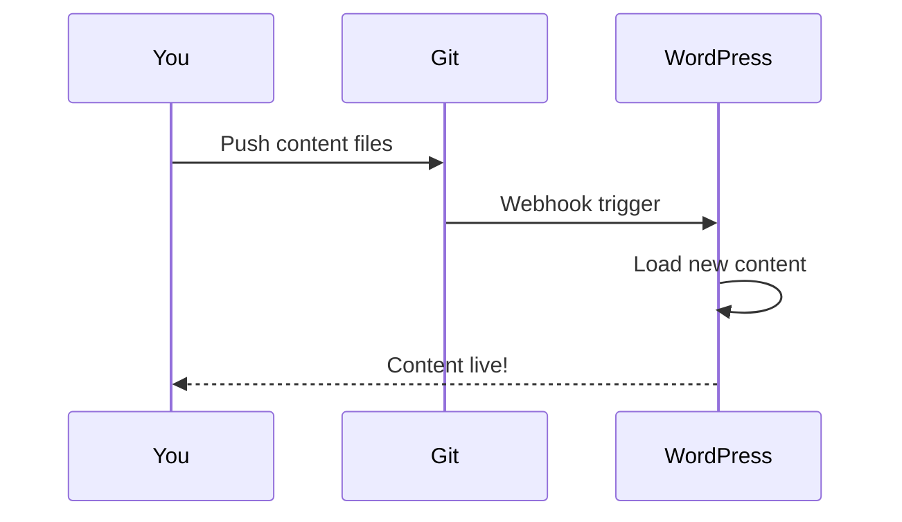

# Git Integration

Version control for your WordPress content.



## How It Works

1. Store content files in a Git repository
2. Push changes to trigger updates
3. WordPress loads content from files

## Benefits

| Benefit | Description |
|---------|-------------|
| 📜 History | Full version control |
| 🔄 Rollback | Revert any change |
| 👥 Collaboration | Multiple editors |
| 🔍 Review | Pull request workflow |

## Setup with GitHub

1. Create a repository for content
2. Add content files
3. Configure webhook (optional)

## GitHub OAuth

For private repos, set up OAuth:

```php
define('GITHUB_CLIENT_ID', 'your_client_id');
define('GITHUB_CLIENT_SECRET', 'your_secret');
```

See [GitHub OAuth Setup Guide](../guides/deployment.md) for details.

## Caching

Content is cached for performance:

```php
// Clear cache programmatically
praison_clear_cache();
```
