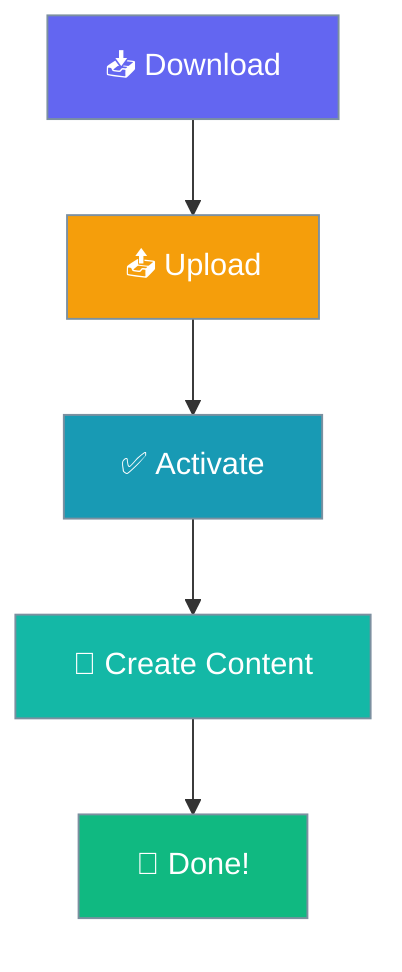

# Installation

Get PraisonPressGit running in minutes.



## Option 1: WordPress Admin

1. Go to **Plugins → Add New**
2. Search for "PraisonPressGit"
3. Click **Install Now**
4. Click **Activate**

## Option 2: Manual Upload

1. Download the plugin ZIP
2. Go to **Plugins → Add New → Upload Plugin**
3. Choose the ZIP file
4. Click **Install Now**
5. Click **Activate**

## What Happens on Activation

The plugin automatically:

- ✅ Creates content directories
- ✅ Sets up submissions page
- ✅ Creates database table for tracking

## Content Directory

Default: `wp-content/uploads/praison-content/`

```
praison-content/
├── posts/
├── pages/
├── lyrics/
├── recipes/
└── config/
```

## Next Step

→ [Configure the plugin](configuration.md)
