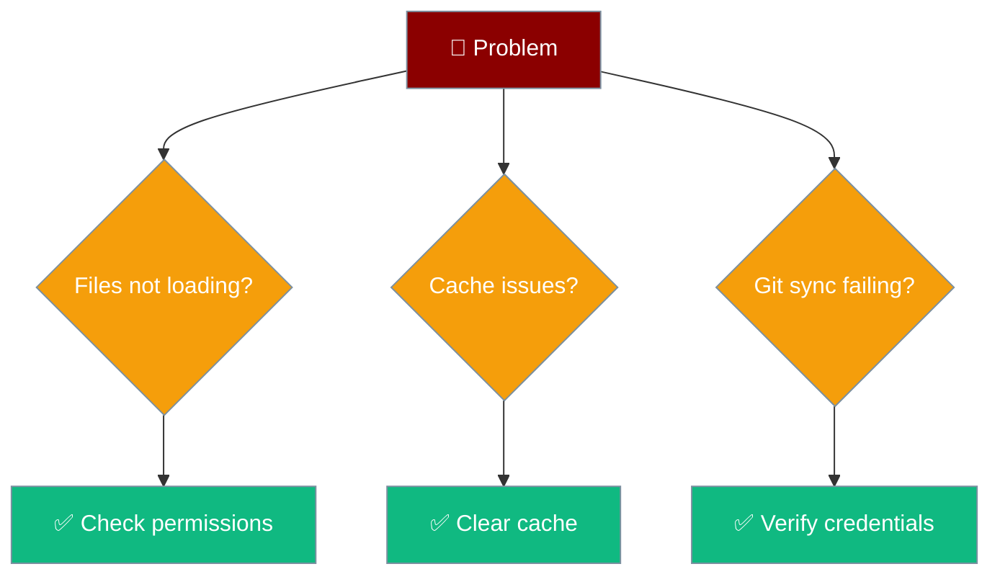

# Troubleshooting

Common issues and fixes.



## Files Not Loading

**Cause:** Directory permissions or wrong path

**Fix:**
1. Check `PRAISON_CONTENT_DIR` is correct
2. Ensure directory is readable by PHP
3. Verify file extensions (`.md`, `.json`, `.yaml`)

## Cache Issues

**Cause:** Stale cache after file changes

**Fix:**
```php
praison_clear_cache();
```

Or use WP-CLI:
```bash
wp cache flush
```

## Git Sync Not Working

**Cause:** Credentials or network issue

**Fix:**
1. Verify `GITHUB_TOKEN` is set
2. Check repository permissions
3. Test network connectivity

## Frontmatter Not Parsed

**Cause:** Invalid YAML syntax

**Fix:**
1. Validate YAML at [yamllint.com](https://www.yamllint.com/)
2. Check for proper `---` delimiters
3. Ensure consistent indentation

## Still Stuck?

[Open an issue on GitHub](https://github.com/MervinPraison/PraisonAI-Git-Posts/issues)
